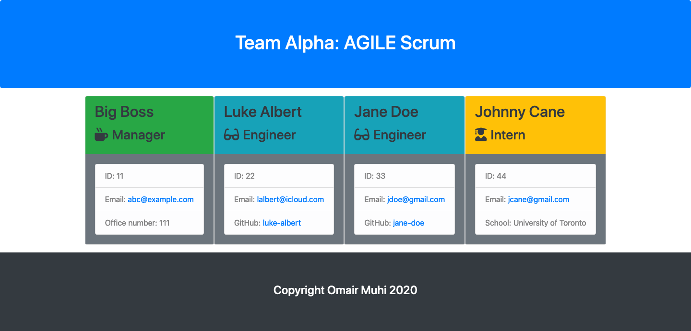

# Template Engine

## Description
This is a node-based command-line application that allows the user to input information about an engineering team (such as Manager, Engineers and Interns) and then generates an HTML page that renders this information in a visually-appealing manner.

## Table of Contents
* [Installation](#installation)
* [Usage](#usage)
* [Contributing](#contributing)
* [Tests](#tests)
* [License](#license)
* [Questions](#questions)

## Installation
1. Run npm install.

## Usage
Run using: 
See walkthrough video here: 

## Contributing
Not Applicable

## Tests

## License
This application is covered under the MIT license.

## Questions
omair-muhi: [https://github.com/omair-muhi](https://github.com/omair-muhi) For additional questions, send an e-mail to: <omairmuhi@icloud.com>
